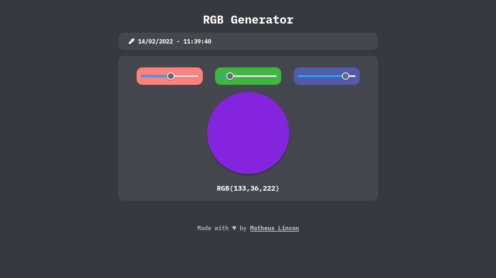

# RGB Generator :art:

## Sobre o projeto :information_source:

- Esse projeto é um _Gerador RGB_. Você pode usar três controladores de cores: vermelho, verde e azul. As modificações poderão ser vistas através de um círculo. E juntamente disso, também temos um tipo de display de data e hora;

- Eu peguei esse projeto do **DevChallenge**, um site muito útil, onde você pode encontrar vários projetos de diferentes tipos: Front-End, Back-End, Mobile,...;

- Você pode ver mais sobre o **DevChallenge** e sobre quem fez o protótipo do projeto acessando os links abaixo:
  - [**DevChallenge site**](https://www.devchallenge.com.br/);
  - [**DevChallenge - Gerador RGB**](https://www.devchallenge.com.br/challenges/600da97d390f5a00213daf8d/details).

---

## Objetivos :dart:

- Meu objetivo com esse projeto foi entender melhor:
  - Manipulação de tempo usando JavaScript;
  - Outros tipos de _eventListeners_.

---

## Tecnologias :wrench:

- As tecnologias usadas no projeto foram:
  - HTML;
  - CSS;
  - JavaScript.

---

## Preview :computer:

---
